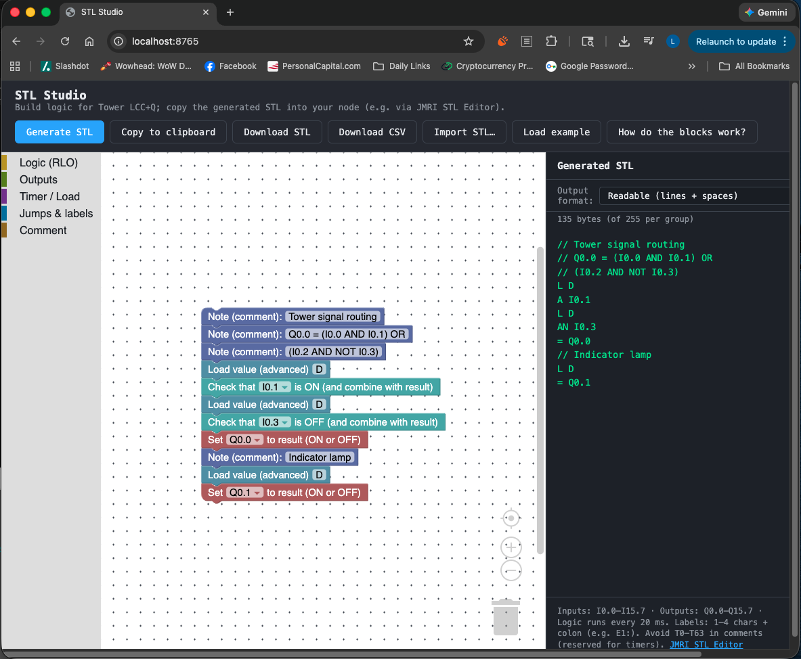

# STL Studio

**Live:** [https://lnevo.github.io/stl-studio](https://lnevo.github.io/stl-studio)

A visual editor that generates **STL (Statement List)** code for the [Tower LCC+Q](https://www.rr-cirkits.com/) device (RR-CirKits 16 I/O LCC node with built-in PLC-style logic). Build logic by snapping pieces together; export the STL and copy it into your node via **Configure Nodes**.



## Why

Writing STL by hand is error-prone. STL Studio lets you build logic by snapping pieces together (Scratch/Blockly style); the **Generate STL** button produces the exact STL text you copy into the node via Configure Nodes.

## Quick start

1. **Open the demo**  
   Serve the folder with any HTTP server, then open `index.html` in a browser.

   ```bash
   # From this directory, for example:
   npx serve .
   # or: python3 -m http.server 8000
   ```

2. **Use the blocks**  
   - Drag blocks from the **Logic**, **Outputs**, **Jumps & labels**, and **Comment** categories into the workspace. Connect blocks in a single stack (one under the other); the full stack is generated as STL in order.
3. **Generate STL**  
   - Click **Generate STL** (or edit blocks; the panel updates automatically).
4. **Copy**  
   - Click **Copy to clipboard** and paste into your Tower LCC+Q node via **Configure Nodes**.
5. **Import STL**  
   - Click **Import STL…**, paste existing STL code (one statement per line), then **Import into workspace** to create blocks from it.

## Block → STL mapping (Tower LCC+Q / JMRI subset)

| Block            | STL output   |
|------------------|-------------|
| CLR (clear result) | `CLR`       |
| SET (set result to 1) | `SET`   |
| AND &lt;var&gt;   | `A Ix.x` / `A Qx.x` / `A Mx.x` / `A Yx.x` / `A Zx.x` / `A Tn` |
| OR / AND NOT / OR NOT | `O` / `AN` / `ON` with same variables |
| NOT (invert result) | `NOT` |
| Assign result to Q/Z/M | `= Qx.x` / `= Zx.x` / `= Mx.x` |
| Set bit           | `S Qx.x` / `S Mx.x` |
| Reset (bit or timer) | `R Qx.x` / `R Mx.x` / `R Tn` |
| L (load timer)    | `L W#2#1` (timer preset only; e.g. L D is not valid) |
| SD (start timer)  | `SD Tn`     |
| FR (free timer)   | `FR Tn`     |
| Label             | `E1:`       |
| JC / JCN / JU     | `JC E1` / `JCN E1` / `JU E1` |
| Comment           | `// ...`    |

**Variables (per Tower LCC+Q):**

- **I** – Logic inputs (LCC events → logic): `I0.0`–`I15.7` (128)
- **Q** – Logic outputs (logic → LCC events): `Q0.0`–`Q15.7` (128)
- **M** – Memory bits: `M0.0`–`M15.7` (usable in A/O/AN/ON, S, R)
- **Y** – Track receivers: `Y0.0`–`Y15.7` (e.g. link speed from Signal LCC)
- **Z** – Track transmitters: `Z0.0`–`Z15.7`
- **T** – Timers: `T0`–`T63` (used with A/O/AN/ON, L, SD, FR, R)

Logic runs every 20 ms; LCC events are consumed in `I` and produced on `Q` when outputs change.

**Tips:**

- **Labels** — Use 1–4 characters plus a colon (e.g. `E1:`, `AB1:`). Jump targets (JC/JCN/JU) use these names.
- **Reserved names** — `T0` through `T63` are reserved for timers. Don’t use them as I/Q/Y/Z names, and avoid mentioning them in comments (e.g. avoid “Set T1 closed”) so the node doesn’t get confused.

## Files

- **index.html** – Single-page app: Blockly workspace + STL preview panel.
- **stl-blocks.js** – Block definitions (logic, assign, set/reset, jumps, labels, comment).
- **stl-generator.js** – Converts blocks to STL text.

## Understanding the logic string (RLO and /FC)

STL on the Tower LCC+Q uses a **logic string**: a series of bit-based logic instructions that yield a true/false state. That state is stored in the **RLO** (result of logic operation). As each instruction runs, its variable is combined with the current RLO using boolean rules to form the new RLO.

- **First bit instruction** in a logic string sets the initial RLO from its variable; it is *not* combined with a previous RLO.
- **Later bit instructions** (A, O, AN, ON) combine their variable with the current RLO.
- The logic string **ends** when the RLO is consumed by a non–bit-logic instruction:
  - Writing to **Q**, **Z**, or **M** (= Q, = Z, = M, S, R)
  - **CLR** or **SET** (they set RLO directly)
  - **Jump** instructions (JC, JCN, JU) — they also set RLO to true after the jump/skip
  - **Timer start** (SD) — so the instruction after `SD Tn` starts a new logic string (e.g. `A Tn` is a one-instruction string)
- **NOT** inverts the RLO but does *not* terminate the logic string.

The **/FC** (Not First Check) control bit governs processing: when /FC is 0, the next bit instruction starts a new logic string; when /FC is 1, bit instructions combine with RLO. Terminating instructions set /FC to 0. (RLO and /FC are not visible in JMRI; see the debugger below.)

**Example** (from the reference doc):

```text
A     I1.0
L     W#2#1
SD    T3
A     T3
=     Q1.0
```

When I1.0 is true, the timer starts. `A T3` is a one-instruction logic string: Q1.0 stays false until the timer finishes, then Q1.0 is set true.

- **Reference:** [Understanding the STL Logic String](https://groups.io/g/layoutcommandcontrol/files/Understanding%20the%20STL%20Logic%20String.pdf) (PDF)
- **Simulate STL and view RLO/FC:** [Q-debugger](https://layoutcommand.store/q-debugger) (web-based)

## Reference

- [JMRI OpenLCB STL Editor](https://www.jmri.org/help/en/package/jmri/jmrix/openlcb/swing/stleditor/StlEditorPane.shtml)
- [Tower LCC+Q manual](https://www.rr-cirkits.com/manuals/TowerLCC+Q-manual-d.pdf) (RR-CirKits)
- [Understanding the STL Logic String](https://groups.io/g/layoutcommandcontrol/files/Understanding%20the%20STL%20Logic%20String.pdf) (PDF)
- [Q-debugger](https://layoutcommand.store/q-debugger) — simulate STL and display control bits (RLO, /FC)
